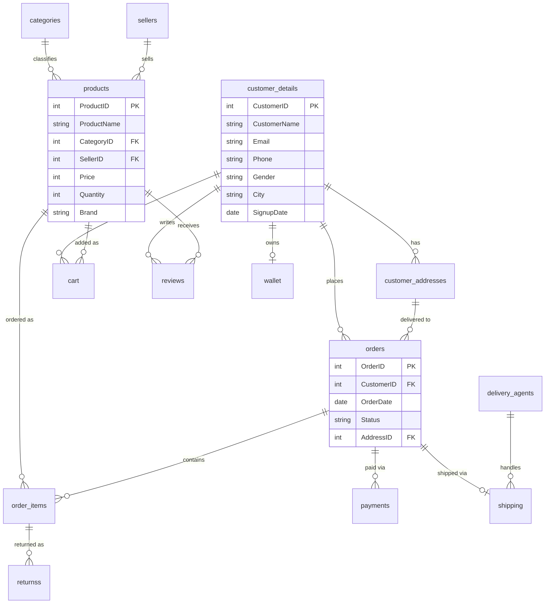

# 🛒 E-Commerce DBMS — SQL Project

A complete relational database design and SQL query project simulating a real-world **e-commerce platform** (think Amazon/Flipkart style) — covering customers, sellers, products, orders, payments, shipping, reviews, coupons, returns, and wallets.

This project includes the **full schema (DDL)**, a **realistic sample dataset (CSV)**, and **40 SQL queries** ranging from basic `SELECT` statements to advanced window functions and CTEs.

---

## 📌 Overview

| | |
|---|---|
| **Database** | `ecommercedbms` |
| **RDBMS** | MySQL |
| **Tables** | 15 |
| **Sample Records** | ~5,000 rows per table |
| **Query Levels** | Basic (20) · Intermediate (12) · Advanced (10) |

---

## 🗂️ Project Structure

```
ecommerce-dbms-sql/
│
├── README.md                     # Project documentation (this file)
├── database/
│   └── E_-_Commerce_DBMS.sql     # Full DDL + all 42 practice queries
│
└── data/                         # Sample CSV datasets (~5,000 rows each)
    ├── customer_details.csv
    ├── customer_addresses.csv
    ├── categories.csv
    ├── sellers.csv
    ├── products.csv
    ├── orders.csv
    ├── order_items.csv
    ├── cart.csv
    ├── payments.csv
    ├── delivery_agents.csv
    ├── shipping.csv
    ├── reviews.csv
    ├── coupons.csv
    ├── returnss.csv
    └── wallet.csv
```

---

## 🧩 Entity Relationship Diagram



---

## 🗃️ Database Schema

<details>
<summary><b>Click to expand full table definitions</b></summary>

| Table | Primary Key | Foreign Keys | Description |
|---|---|---|---|
| `customer_details` | `CustomerID` | — | Registered customers |
| `customer_addresses` | `AddressID` | `CustomerID` | Multiple addresses per customer |
| `categories` | `CategoryID` | — | Product categories |
| `sellers` | `SellerID` | — | Marketplace sellers |
| `products` | `ProductID` | `CategoryID`, `SellerID` | Product catalog |
| `orders` | `OrderID` | `CustomerID`, `AddressID` | Customer orders |
| `order_items` | `OrderItemID` | `OrderID`, `ProductID` | Line items per order |
| `cart` | `CartID` | `CustomerID`, `ProductID` | Active shopping carts |
| `payments` | `PaymentID` | `OrderID` | Payment transactions |
| `delivery_agents` | `AgentID` | — | Delivery personnel |
| `shipping` | `ShippingID` | `OrderID`, `AgentID` | Shipment tracking |
| `reviews` | `ReviewID` | `ProductID`, `CustomerID` | Product reviews & ratings |
| `coupons` | `CouponID` | — | Discount coupons |
| `returnss` | `ReturnID` | `OrderItemID` | Product returns/refunds |
| `wallet` | `WalletID` | `CustomerID` | Customer wallet balance |

</details>

---

## ⚙️ Setup & Installation

1. **Clone the repository**
   ```bash
   git clone https://github.com/nithish-0706/e-commerce-dbms.git
   cd ecommerce-dbms-sql
   ```

2. **Create the database**
   ```bash
   mysql -u root -p < database/E_-_Commerce_DBMS.sql
   ```

3. **Import the sample CSV data** (using MySQL Workbench "Table Data Import Wizard", or the `LOAD DATA INFILE` command) into each corresponding table from the `data/` folder — in this order to respect foreign keys:
   ```
   customer_details → customer_addresses → categories → sellers → products
   → orders → order_items → cart → payments → delivery_agents
   → shipping → reviews → coupons → returnss → wallet
   ```

4. Run any query from `database/E_-_Commerce_DBMS.sql` to start exploring! 🎉

---

## 📊 SQL Queries Included (42 total)

### 🟢 Basic (20)
Simple `SELECT`, `WHERE`, `ORDER BY`, `LIKE`, `LIMIT`, `COUNT` — e.g. filtering customers by city, top 10 expensive products, low-stock items, customers whose name starts with "S".

### 🟡 Intermediate (12)
`JOIN`s, `GROUP BY`, aggregate functions — e.g. seller-wise product count, top 5 spenders, category-wise average price, month-wise order trends, most-used payment mode.

### 🔴 Advanced (10)
Window functions, CTEs, correlated subqueries — e.g.
- Rank customers by total spend (`RANK() OVER`)
- Running total of daily revenue (`SUM() OVER`)
- Top 3 best-selling products (CTE)
- Month-over-month revenue growth (`LAG()`)
- Second-highest priced product per category (`DENSE_RANK()`)
- Best-selling product per seller (CTE + `RANK()`)
- Delivery agent on-time delivery rate

<details>
<summary><b>Example: Rank customers by total spending</b></summary>

```sql
SELECT
    c.CustomerID,
    c.CustomerName,
    SUM(p.AmountPaid) AS TotalSpend,
    RANK() OVER (ORDER BY SUM(p.AmountPaid) DESC) AS SpendRank
FROM payments p
JOIN orders o ON p.OrderID = o.OrderID
JOIN customer_details c ON o.CustomerID = c.CustomerID
WHERE p.PaymentStatus = 'Success'
GROUP BY c.CustomerID, c.CustomerName
ORDER BY SpendRank;
```
</details>

---

## 🛠️ Tech Stack

- **Database:** MySQL 8.0+
- **Concepts used:** DDL, joins, subqueries, CTEs, window functions (`RANK`, `DENSE_RANK`, `LAG`, running totals), aggregate functions, date functions

---

## 🚀 Future Enhancements

- [ ] Add stored procedures & triggers (e.g. auto-update stock on order)
- [ ] Build a Power BI / Tableau dashboard on top of this schema
- [ ] Add indexing & query performance analysis
- [ ] Normalize further to 3NF / add order-status history table

---

## 👤 Author

**Name : Nithish**
📧 nithishjrp@gmail.com · 🔗 [LinkedIn](https://www.linkedin.com/in/nithish-jrp/) · 💻 [GitHub](https://github.com/nithish-0706)

---

## 📄 License

This project is open-sourced under the [MIT License](LICENSE).
